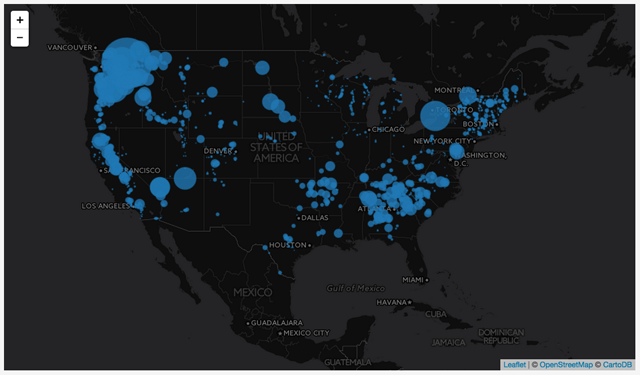
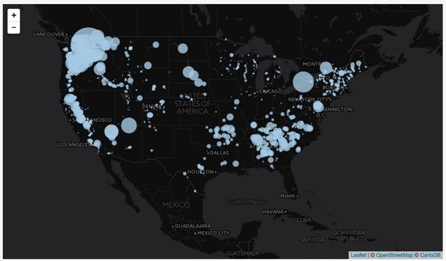
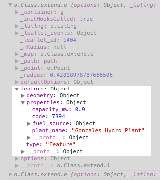
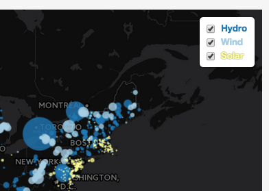

# Lesson 08: Mastering Leaflet's GeoJSON Methods and Layer Controls

## Goals

We will continue to work with GeoJSON data for U.S. power plants and learn how to apply Leaflet methods and event handling to produce interactive analysis.


## Table of Contents

<!-- TOC -->

- [Lesson 08: Mastering Leaflet's GeoJSON Methods and Layer Controls](#lesson-08-mastering-leaflets-geojson-methods-and-layer-controls)
    - [Goals](#goals)
    - [Table of Contents](#table-of-contents)
    - [Overview](#overview)
    - [Leaflet L.geoJson() Review](#leaflet-lgeojson-review)
    - [Using Leaflet methods to access and modify layers after creation](#using-leaflet-methods-to-access-and-modify-layers-after-creation)
        - [Applying methods to the GeoJson layer variable](#applying-methods-to-the-geojson-layer-variable)
        - [Accessing individual elements in a GeoJson layer](#accessing-individual-elements-in-a-geojson-layer)
        - [User interaction scenario: user clicking to search and filter](#user-interaction-scenario-user-clicking-to-search-and-filter)
    - [Adding a Leaflet Layer Control Object](#adding-a-leaflet-layer-control-object)
    - [Advanced Topic: Refactoring Your Code](#advanced-topic-refactoring-your-code)
    - [Addendum I: Summary statistics of attributes in search radius](#addendum-i-summary-statistics-of-attributes-in-search-radius)

<!-- /TOC -->

## Overview

This lesson continues our study of creating and using the Leaflet *L.GeoJson* class, our most useful and powerful Leaflet method. Beyond the options available when we create layers using this method such as *pointToLayer*, *filter*, *oneEachFeature*, we're going to invoke Leaflet methods on layer groups and individual layers after creation.

We'll also learn how to use a Leaflet layer control to manage multiple data layers, and practice setting universal styles and layer-specific styles using the L.GeoJson *style* option. We'll finish up by introducing some advanced techniques for code refactoring.

Part of the lab requirements will have you finish the map made in this lesson. Please, read the instructions for the [Lab 08](lab-08/) before you begin. The first part of the lab asks you to write, commit, and submit the code demonstrated within the lesson tutorial below (**4 points**). You'll then complete a similar mapping challenge for the remaining **6 points**.

## Leaflet L.geoJson() Review

In the previous module, we learned how to load GeoJSON data &ndash; stored as a JavaScript object and saved within an external file &ndash; into our script. We then used the Leaflet `L.geoJson()` method to draw these point-level data to a Leaflet GeoJson layer, which we then added to our map. We also used `L.geoJson()`'s options:

* *pointToLayer* to convert default Leaflet markers to *circleMarkers*,
* *filter* to show only features meeting specific criteria, and
* *onEachFeature* to bind Leaflet *Tooltip* objects to the features and attach additional event listeners such as *mouseover* and *mouseout*

Open the *lesson-08/index.html* file and begin editing to follow along with the lesson.

An essential part of the script was using a custom JavaScript function we wrote to determine the radius for each of the proportional symbols we created. The following code exemplifies the creation of a Leaflet GeoJson layer comprising hydroelectric plants.


```javascript
L.geoJson(plants, {
    pointToLayer: function (feature, latlng) {
        return L.circleMarker(latlng, {
            color: '#1f78b4',
            fillColor: '#1f78b4',
            weight: 1,
            stroke: 1,
            fillOpacity: .8,
            radius: getRadius(feature.properties.fuel_source.Hydro)
        });
    },
    filter: function (feature) {
        if (feature.properties.fuel_source.Hydro) {
            return feature;
        }
    }
}).addTo(map);
```

The `getRadius()` function call passes the value of each `"Hydro"` fuel source into the `getRadius()` function, which returns a specific numeric value. We then assign that value of the `radius` property of the `L.circleMarker`'s style options.

```javascript
function getRadius(val) {
 var radius = Math.sqrt(val/Math.PI);
 return radius * .8;
}
```

Thus in relatively few lines of code, we dynamically create a proportional symbol map that looks like this:

    
*Proportional Symbol Map of Hydro Power*

We can also use another Leaflet *L.geoJson* option, the *style* option, to apply the same path styles to our *CircleMarker* layers as we create them. The following code produces the same map as the previous one but through using the *style* option:

```javascript
L.geoJson(plants, {
    pointToLayer: function (feature, latlng) {
        return L.circleMarker(latlng);
    },
    filter: function (feature) {
        if (feature.properties.fuel_source.Hydro) {
            return feature;
        }
    },
    style: function (feature) {
        return {
            color: '#1f78b4',
            fillColor: '#1f78b4',
            weight: 1,
            stroke: 1,
            fillOpacity: .8,
            radius: getRadius(feature.properties.fuel_source.Hydro)
        }
    }
}).addTo(map);
```

Drawing our proportional symbol map in this way is great, but it's a bit of a one-shot deal. In this case, once this code runs, our map is drawn, and that's it.

How do we access and manipulate our features (e.g., proportional symbols) later on, such as resizing the symbols for a different data attribute? The answer lies in built-in Leaflet methods.

## Using Leaflet methods to access and modify layers after creation

The power of web mapping lies not just in our ability to dynamically create data-driven maps. Rather, it lies in the potential to change the map dynamically once it has already been drawn. Such "event-driven" changes may add or remove data layers from the map, filter the data in some way, update a data layer, or re-symbolize the data. Sometimes these event-driven changes occur automatically (such as a map that is continually updated with real-time data). Often, however, we're concerned with user-generated change: interaction with the map.

### Applying methods to the GeoJson layer variable

To access the Leaflet GeoJson layer we create, we first need to store a reference to it. This is as easy as creating a variable and assigning it to our `L.geoJson()` method call. Simply by adding the `var hydroLayer =` we can access the layer we've already been using in cool ways.

```javascript
var hydroLayer = L.geoJson(plants, {
 pointToLayer: function(feature,latlng) {
 return L.circleMarker(latlng);
 }, // … more code
});
```

Once we create this `hydroLayer` variable (as a reference to our Leaflet GeoJson layer, i.e., our hydro proportional symbols), we can then apply the [methods available](https://leafletjs.com/reference.html#geojson-adddata) to a GeoJson layer. Additional methods are inherited. Using these methods we can retrieve information from features and modify previously rendered layers.

For example, after drawing all our *circleMarkers* as the blue (hex color `#1f78b4`) above, later in the script we could change their color with a `.setStyle()` method. But wait! We have a `.setStyle()` [method in a GeoJson layer](https://leafletjs.com/reference-1.6.0.html#geojson-setstyle) and a `.setStyle()` [method as a FeatureGroup](https://leafletjs.com/reference-1.6.0.html#geojson-setstyle). Recall that Leaflet's *GeoJson* layer extends *L.FeatureGroup*.

As a FeatureGroup, we can pass a [path options](https://leafletjs.com/reference-1.6.0.html#path-option) object to change all layers in the group. This means that the `.setStyle() method`, used as the `hydroLayer.setStyle({ ....` is able to update each Leaflet representation of our GeoJSON features.

```javascript
var hydroLayer = L.geoJson(plants, {
    pointToLayer: function (feature, latlng) {
        return L.circleMarker(latlng, commonStyles);
    },
    filter: function (feature) {
        if (feature.properties.fuel_source.Hydro) {
            return feature;
        }
    },
    style: function (feature) {
        return {
            color: '#1f78b4',
            fillColor: '#1f78b4',
            radius: getRadius(feature.properties.fuel_source.Hydro)
        }
    }
}).addTo(map);

// Change all layers in FeatureGroup with path options object
hydroLayer.setStyle({
    color: '#a5c9e2',
    fillColor: '#a5c9e2'
});
```

The result then is that the `setStyle()` method has uniformly changed the style options of the elements contained within the layer referenced by the `hydroLayer` variable, turning dark blue circles into light blue circles:

   
*Changing a GeoJson layer with the setStyle method*

As a geoJson layer, the `.setStyle()` method can use a style function to symbolize layers from feature attributes. We can set the path options for all layers with the following syntax.

```js
// Change all layers in GeoJson with style function
hydroLayer.setStyle(function (feature) {
    return {
        color: '#a5c9e2',
        fillColor: '#a5c9e2'
    }  
});
```

Let's say we want to symbolize larger capacity hydro facilities differently? We need to use an `if/else` statement as shown here:

```js
// Change all layers in GeoJson with style function
hydroLayer.setStyle(function (feature) {
    if (feature.properties.fuel_source.Hydro > 100) {
        return {
            color: '#0062c5', // darker blue
            fillColor: '#a5c9e2'

    } else {
        return {
            color: '#a5c9e2',
            fillColor: '#a5c9e2'
    } 
}
     
});
```

Pay careful attention to the way we write the `.setStyle()` method for a geoJson layer here. You can see that it passes one argument, which is itself a function. This argument is an anonymous function, meaning that it has no name and can not be called later in the script. You've seen this kind of function before. It is invoked immediately for each layer contained within the `hydroLayer` GeoJson layer. This function, in turn, accepts a parameter, here written as `feature`, which is a reference to each GeoJSON feature (i.e., we can access all of the feature properties).

This is a trivial example to show the many ways that we can accomplish the same task with Leaflet. An understanding of this can help you share and use other mappers' Leaflet code. Note, none of this is event-driven, yet. The script runs and then changes the previously set path options to different values. However, you can imagine how you'd invoke this method to set all circles to be blue when the user clicks on the map (i.e., using the `map.on('click', ...)`)?

For now, this example demonstrates how we can use a method to change an entire set of features contained within a GeoJson layer. What about accessing and modifying the individual elements within a GeoJson layer (i.e., the individual circles) after we've created them?

### Accessing individual elements in a GeoJson layer

As we've noted, the *GeoJson* layer extends *L.FeatureGroup*, which extends *L.LayerGroup*, which has all sorts of fun methods for layer manipulation. One of the most important of these is the `.eachLayer()` method [http://leafletjs.com/reference.html#layergroup-eachlayer](http://leafletjs.com/reference.html#layergroup-eachlayer) which is an important method in Leaflet for an event-driven change of our data-driven symbology features. Let's first walk through how it works before considering a practical example.

We'll start with the GeoJson layer of hydropower from above, which we are now referencing with the `hydroLayer` variable. After it's been created, we invoke this `.eachLayer()` method on this variable, which allows us to access every layer (i.e., individual *circleMarker*) within the GeoJson layer. It's like the *onEachFeature* option we used when we created the layer, only it's being invoked and running after the fact.

```javascript
var hydroLayer = L.geoJson(plants, {
    pointToLayer: function (feature, latlng) {
        return L.circleMarker(latlng);
    },
    filter: function (feature) {
        if (feature.properties.fuel_source.Hydro) {
            return feature;
        }
    },
    style: function (feature) {
        return {
            color: '#1f78b4',
            fillColor: '#1f78b4',
            weight: 1,
            stroke: 1,
            fillOpacity: .8,
            radius: getRadius(feature.properties.fuel_source.Hydro)
        }
    }
}).addTo(map);

hydroLayer.eachLayer(function (layer) {
    // code goes here
    console.log(layer);
});
```

Similar to the `.setStyle()` method discussed above, the method passes an anonymous function as an argument. This function accepts a parameter, here written as `layer`, which is a reference to each layer (i.e., circleMarker in this case). We are then able to access this layer within the anonymous function's body, in this example, through a console log statement.

Let's carefully examine the output in the console. We see that it has logged each layer within our `hydroLayer` GeoJson layer:

     
*Console output for logging each layer of our GeoJson layer*

While many of the properties of this layer output are not of immediate interest to us, we should be able to recognize the `feature` property:

     
*The feature option of each layer*

Here we can access the GeoJSON data from which we drew our Leaflet GeoJson layer. Leaflet, upon creating these SVG elements (*circleMarkers*), stores the feature data for each within each layer. 

### User interaction scenario: user clicking to search and filter

Let's say that, upon clicking on the map, we want to see the proportional symbols within 500 km of the clicked point. To do so, we'll use the Leaflet `.on()` method and attach it using dot notation to the `map` variable. This `.on()` method is listening for a `'click'` event. When a click occurs, it immediately invokes an anonymous function, which accepts a parameter `e`. As demonstrated in previous labs, this `e` is a reference to the click event itself, and we can obtain the coordinates of this using `e.latlng`.

```javascript
var hydroLayer = L.geoJson(plants, {
    pointToLayer: function (feature, latlng) {
        return L.circleMarker(latlng);
    },
    filter: function (feature) {
        if (feature.properties.fuel_source.Hydro) {
            return feature;
        }
    },
    style: function (feature) {
        return {
            color: '#1f78b4',
            fillColor: '#1f78b4',
            weight: 1,
            stroke: 1,
            fillOpacity: .8,
            radius: getRadius(feature.properties.fuel_source.Hydro)
        }
    }
}).addTo(map);

map.on('click', function (e) {
    console.log(e.latlng) // access to the click coordinates
    hydroLayer.eachLayer(function (layer) {
        console.log(layer.getLatLng()); // access to the layer coordinates
    });
});
```

Within the `.on()` method's callback, we are then invoking the `.eachLayer()` method on the `hydroLayer` variable, and thus iterating through all our hydropower proportional symbols. These are Leaflet *circleMarker* objects, extended from the *circle* object, so we can obtain their coordinate position using the *circle* object's [`.getLatLng()` method](http://leafletjs.com/reference.html#circle).

With these two pieces of information, we can then use the `.distanceTo()` method to calculate the distance between our click point and each GeoJson feature (i.e., each of our proportional symbol layers), and store this distance (in meters) as a variable.

```javascript
map.on('click', function(e) {
 hydroLayer.eachLayer(function(layer) {
 var distance = e.latlng.distanceTo(layer.getLatLng());
 console.log(distance); // distance in meters between click point
 // and each layer's centroid
 });
});
```

Then, we can use a conditional statement to determine if each layer is located more than 500 km from our click point. If it is, we can invoke the `setStyle()` method on that particular layer to change the path `stroke` and `fill` properties to false (thereby rendering the feature invisible). We could also change the style of layers within 500 km, but we'll send values of `true` so nothing will change for those layers.

```javascript
map.on('click', function (e) {
    hydroLayer.eachLayer(function (layer) {
        var distance = e.latlng.distanceTo(layer.getLatLng()) / 1000; // distance as km

        if (distance > 500) {
            layer.setStyle({
                stroke: false,
                fill: false
            });
        } else {
            layer.setStyle({
                stroke: true,
                fill: true
            });
        }
    });
});
```

The result of the code is below.

 
*Features beyond 500 km rendered invisible*

Subsequently, clicking on the map will again iterate through all the features and reset their styles based on their distance from the new click point. We can additionally bind a Leaflet Popup to each layer and update it with newly generated information, such as its distance from the click point.

```javascript
map.on('click', function (e) {
    hydroLayer.eachLayer(function (layer) {
        var distance = e.latlng.distanceTo(layer.getLatLng()) / 1000;

        if (distance > 500) {
            layer.setStyle({
                stroke: false,
                fill: false
            });
        } else {
            layer.setStyle({
                stroke: true,
                fill: true
            });

            layer.bindPopup(`I am <b>${distance.toLocaleString()}km</b><br> from the click point.`);
        } // end else
    });
});
```

These small changes are producing a lot of cool interactivity and useful information.

 
*Leaflet Tooltip dynamically updated with content*

The critical part to remember is that we can invoke Leaflet methods to access and update our drawn L.geoJson layers after they are initially drawn. This opens up a world of possibilities for user interaction and other events.

## Adding a Leaflet Layer Control Object

One advantage of creating separate Leaflet GeoJson layers is that we can use another handy piece of Leaflet's built-in functionality, the layers control [http://leafletjs.com/reference.html#control-layers](http://leafletjs.com/reference.html#control-layers). This control allows us the user to toggle on and off various layers we've created. Leaflet even provides a default user interaction (UI) element for doing this.

**NOTE:** To continue through this lesson, quickly reproduce a bivariate map with three fuel sources first. Use three separate L.geoJson() method calls and assign each to a variable name (e.g., `hydroLayer`, `windLayer`, and `solarLayer`).

First, create an object whose properties use these variables as the value, while the property names are the text we wish to appear within the layer control. We've stored these properties within an object referenced with the variable `sourcesLayers`

```javascript
var sourcesLayers = {
 "Hydro": hydroLayer,
 "Wind": windLayer,
 "Solar": solarLayer
}
```

Then we invoke a `L.controls.layers()` method, passing three arguments into it:

```javascript
var sourcesLayers = {
 "Hydro": hydroLayer, // hydroLayer references a Leaflet L.GeoJSON layer
 "Wind": windLayer,
 "Solar": solarLayer
}

L.control.layers(null, sourcesLayers, { collapsed:false }).addTo(map);
```

1. The first argument controls the basemap layers (i.e., the tiled basemap we add to the map at the beginning of our script). For this example, we're not allowing the user to change the base map, so we'll make it null.
2. The second argument references the `sourcesLayers` object we created.
3. Finally, we can pass an optional third argument, in this case containing a property that keeps the layer control UI open instead of collapsing it. We then add the layer control to the map.

The result is that the user can now toggle on and off the layers made available to the layer control.

Note that the property names within the `sourcesLayers` object can include HTML tags. So, for example, if we want to make our layer control labels the color of our respective fuel sources (acting as a minimal kind of legend), we could write the names like this:

```javascript
var sourcesLayers = {
 "<b style='color:#1f78b4'>Hydro</b>": hydroLayer,
 "<b style='color:#a6cee3'>Wind</b>": windLayer,
 "<b style='color:#ffff99; text-shadow: 0px 0px 1px #333;'>Solar</b>": solarLayer
}
```

We've wrapped the text for the labels in HTML `<b>` tags to make the text bold, and we've applied inline CSS style rules to color the text. We've also included a text-shadow property to make the light yellow color stand out against the white background.

     
*Leaflet layer control with Label text styled*

## Advanced Topic: Refactoring Your Code

To wrap up this lesson, we'll revisit some redundant code we wrote when creating the separate L.GeoJson layers for each fuel source type. Our script runs successfully and plots the various colored circleMarkers on the map, which is good.

However, we see there is some redundancy. How so? All three chunks of code creating the Leaflet GeoJson layers are written almost identically, except for the strings used to access the different fuel types, and the colors. Note the similarity in the two structures used to build hydro and wind:

```javascript
var commonStyles = {
    weight: 1,
    stroke: 1,
    fillOpacity: .8
}

var hydroLayer = L.geoJson(plants, {
    pointToLayer: function (feature, latlng) {
        return L.circleMarker(latlng, commonStyles);
    },
    filter: function (feature) {
        if (feature.properties.fuel_source.Hydro) {
            return feature;
        }
    },
    style: function (feature) {
        return {
            color: '#1f78b4',
            fillColor: '#1f78b4',
            radius: getRadius(feature.properties.fuel_source.Hydro)
        }
    }
}).addTo(map);

var windLayer = L.geoJson(plants, {
    pointToLayer: function (feature, latlng) {
        return L.circleMarker(latlng, commonStyles);
    },
    filter: function (feature) {
        if (feature.properties.fuel_source["Wind"]) {
            return feature;
        }
    },
    style: function (feature) {
        return {
            color: '#a6cee3',
            fillColor: '#a6cee3',
            radius: getRadius(feature.properties.fuel_source["Wind"])
        }
    }
}).addTo(map);
```

While there is nothing wrong with this code, imagine if we wanted to make our map with all 13 of our fuel sources as separate Leaflet GeoJson layers. The repetition of the code would become very unwieldy which also increases the chance for errors.

Besides, suppose we wanted to add another conditional statement within the *filter* option to filter out plants under a certain level of power production. We'd have to edit every one of the 13 code blocks!

Instead, we recognize where the redundant code is and think of ways to loop through it.

The trick to doing this is to recognize where the values will be different for each one. So, for this example, we see this part remains the same for each:

```js
var hydroLayer = L.geoJson(plants, {
 pointToLayer: function(feature, latlng) {
 return L.circleMarker(latlng, commonStyles);
 }, /// more code here
});
```

Within the *filter option*, only the name of the fuel source will change, so, in this case, we're starting to think about substituting the hard-coded `"Hydro"` with a variable whose value will change as we loop through the entire structure:

```javascript
filter: function(feature) {
 if(feature.properties.fuel_source[<variableName>]) {
 return feature;
 }
},
```

Finally, we see the hexadecimal color values for each has been hard-coded, so we'll want to swap those out with variables, as well as the fuel source we're using to pass a value to the `getRadius()` function.

```javascript
style: function(feature) {
 return {
 color: <variableName>,
 fillColor: <variableName>,
 radius: getRadius(feature.properties.fuel_source[<variableName>])
 }
}
}).addTo(map);
```

We know that instead of repeating that same structure over and over again, we want to loop through it, substituting values for variable names upon each iteration. This is similar to the simple for loops we've been using.

First, we'll create a JS object to hold the information we want to insert within the code. For this example, we'll use our anticipated variable name for each Leaflet L.geoJson layer as the property name, and then an object of the associated information for each layer.

```javascript
var layerInfo = {
 hydroLayer: {source:"Hydro", color:'#1f78b4'},
 windLayer: {source:"Wind", color:'#a6cee3'}
};
```

We're going to loop through this object called `layerInfo`, but before we do (and this is a bit tricky to get your head around) we'll create an empty object `var geoJsonLayers = {}` to hold the variable names for each Leaflet GeoJson layer we'll be creating.

```javascript
var layerInfo = {
 hydroLayer: {source:"Hydro", color:'#1f78b4'},
 windLayer: {source:"Wind", color:'#a6cee3'}
};

var geoJsonLayers = {};
```

Now we're ready to construct our looping structure. Because we're looping through a JS object `layerInfo`, and not an array, we'll be using the `for(var name in object)` looping structure. You'll want to `console.log(layer, layerInfo[layer])` within this loop to understand how it is accessing the object property names and values.

Essentially, with each iteration here, `layer` will be the property name (i.e., `"hydroLayer"`, `"windLayer"`) and `layerInfo[layer]` will be accessing the associated array (i.e., `source:"Hydro", color:'#1f78b4'`)

The following code then achieves the same thing as repeating the structure to create the GeoJson layers:

```javascript
for (var layer in layerInfo) {
    geoJsonLayers[layer] = L.geoJson(plants, {
        pointToLayer: function (feature, latlng) {
            return L.circleMarker(latlng, commonStyles);
        },
        filter: function (feature) {
            if (feature.properties.fuel_source[layerInfo[layer].source]) {
                return feature;
            }
        },
        style: function (feature) {
            return {
                color: layerInfo[layer].color,
                fillColor: layerInfo[layer].color,
                radius: getRadius(feature.properties.fuel_source[layerInfo[layer].source])
            }
        }
    }).addTo(map);
```

Furthermore, we've dynamically created variable names for each GeoJson layer and stored them as property names with the `geoJsonLayers` object with the `geoJsonLayers[layer] = …` statement. Therefore, we can still access those layers (and add them to our Leaflet layer control by writing `geoJsonLayers.hydroLayer` etc.

The full solution then looks like this:

```javascript
// Define the desired layers and their colors to place 
// as JS object
var layerInfo = {
    hydroLayer: {
        source: "Hydro",
        color: '#1f78b4'
    },
    windLayer: {
        source: "Wind",
        color: '#a6cee3'
    }
};

// Build empty JS object
var geoJsonLayers = {};

// Loop through first object
for (var layer in layerInfo) {
    // Populate the second object with all features that
    geoJsonLayers[layer] = L.geoJson(plants, {
        // we convert to a layer
        pointToLayer: function (feature, latlng) {
            return L.circleMarker(latlng, commonStyles);
        },
        // exist in our first object
        filter: function (feature) {
            if (feature.properties.fuel_source[layerInfo[layer].source]) {
                return feature;
            }
        },
        // and match the style given in first object and with getRadius()
        style: function (feature) {
            return {
                color: layerInfo[layer].color,
                fillColor: layerInfo[layer].color,
                radius: getRadius(feature.properties.fuel_source[layerInfo[layer].source])
            }
        }
    }).addTo(map);
}

function getRadius(val) {
    var radius = Math.sqrt(val / Math.PI);
    return radius * .8;
}

var sourcesLabels = {
    "Hydro": geoJsonLayers.hydroLayer,
    "Wind": geoJsonLayers.windLayer
}

L.control.layers(null, sourcesLabels, {
    collapsed: false
}).addTo(map);
```

After we have built this new object with all of the desired layers, we can loop through it when we click the map.

```javascript
map.on('click', function (e) {
    // Loop through object containing geojson layers
    for (var gsLayer in layerInfo) {

        // Add a function to each layer geoJsonLayers object
        // Important! We need to make a distinction between
        // gsLayer (a key in layerInfo that matches a key in geoJsonLayers) 
        // and layer (a function parameter)

        geoJsonLayers[gsLayer].eachLayer(function (layer) {

            // Compare this output and understand how data are accessed
            console.log(`layerInfo[gsLayer]: ${layerInfo[gsLayer].source} \n*******\n`)
            console.log(`geoJsonLayers[gsLayer]: ${geoJsonLayers[gsLayer]} \n*******\n`)
            console.log(`gsLayer: ${gsLayer} \n*******\n`)
            console.log(`layer: ${layer} \n*******\n`)

            var distance = e.latlng.distanceTo(layer.getLatLng()) / 1000;

            if (distance > 500) {
                layer.setStyle({
                    stroke: false,
                    fill: false
                });
            } else {
                layer.setStyle({
                    stroke: true,
                    fill: true
                });


                // Create tooltip!
                // First get the properties of the for each geojson feature
                var props = layer.feature.properties;

                var content = `<h3>${props.plant_name}</h3>`;

                // Some plants have more than one fuel source
                // Find the most dominate and add it to the popup
                var compare = 0
                var dominate = ''
                for (var type in props.fuel_source) {
                    content += `${type}: 
                                ${props.fuel_source[type].toLocaleString()} MW <br>`;
                    if (props.fuel_source[type] > compare) {
                        compare = props.fuel_source[type]
                        dominate = type
                    }
                }

                // Get fancy with adding color to the popup
                content += `A <span style='color:${layerInfo[gsLayer].color}'>
                           ${layerInfo[gsLayer].source}</span> facility <b> 
                           ${distance.toLocaleString()} km</b><br> 
                           from the click point.<br>
                           Primarily a ${dominate} plant.`


                layer.bindTooltip(content);
            }
        });
    }
});
```

Such refactoring of your code will lead to greater cleanliness, maintainability, and extensibility. For example, if we want to add additional fuel sources, we can more easily do so now. 

Please submit the completed *index.html* from this lesson with your lab assignment for this week for **4 points** of the week's grade. The [lab assignment](lab-08/) for this week will ask you to integrate the examples learned in this lesson to fulfill the requirements of a larger mapping scenario.

## Addendum I: Summary statistics of attributes in search radius

Let's say you wanted to summarize the attributes of features within a search distance. For example, the total Megawatts produced in each sector within 500 km of a clicked point. We already presented how to capture features within a distance of click; let's now loop through those features and summarize values. 

The general approach is to 
1. create empty JS object variables inside the click event
2. loop through our object of `geoJsonLayers` and, if values exist, add them into an empty object
3. loop through this new object to create popup content.

Before we start looping, let's create a Leaflet Circle object that we'll drop on the map when it is clicked. This will show our area of interest and help the viewer better understand the extent of our analysis. Add the following outside of the `map.on()` method block.

```js
var radiusCircle = L.circle([0, 0], 500000, {
 fillColor: 'white',
 fillOpacity: .1,
 color: 'yellow',
 opacity: .3,
 stroke: false,
 weight: 3,
 interactive: false // This allows users to click through the circle
 })
```

Now, create the empty variables and place the the `radiusCircle` object immediately after the click event is fired. Note: you can use the `.on()` method or the `addEventListener()` method to handle the event.

```js
map.on('click', function (e) {
 var stats = {}; // Empty object we'll use to sum MW values
 var statsContent = ''; // Empty string we'll use for popup content
 var total = 0; // var we'll use to count total MW in area of interest
 
 // center circle location on current click point
 radiusCircle.setLatLng(e.latlng)
 .addTo(map);
```
Within the `geoJsonLayers[gsLayer].eachLayer(function(layer) {` and after the binding the `tooltip()` add the `for` loop that accesses all of the fuel types for each feature. If the fuel source will create a new key and add up all of the sources.


```js 
// Loop through all sources, add new key, and add the totals
for (var source in props.fuel_source) {
    total += props.fuel_source[source]
    if (stats[source]) {
        stats[source] += props.fuel_source[source];
    } else {
        stats[source] = props.fuel_source[source];
    }
}
// Make one last key/value pair
stats["Total"] = total
// Behold the power of addition!
console.log(stats)
```

We should now have a object with all fuel sources and their Megawatt capacities. We need to now add this statistics to our map. Let's do it with a popup on the `radiucCircle` object we added with the event. After the `.eachLayer()` method, but still inside the `map.on()` block, iterate through the `stats` object and build a popup.

```js
for (var stat in stats) {
    // Make sure not to grab the total key
    if (stat != "Total") {
        statsContent += `<b>${stat}:</b> 
    ${stats[stat].toLocaleString()} MW 
    (${((stats[stat]/stats.Total)*100).toLocaleString()}%)<br>`
    }
}
// Outside of for loop, add the Total line 
statsContent += `<b>TOTAL: </b> ${stats.Total.toLocaleString()} MW`

// Bind the popup and open it!
radiusCircle.bindPopup(statsContent)
    .openPopup();
```

Once you have dropped in your code, your map might behave similarly to the below map. These summary statistics can exist outside of the popup. How could you add them to a `div` element in the page's content?

 
*Presenting summary statistics in the popup*
