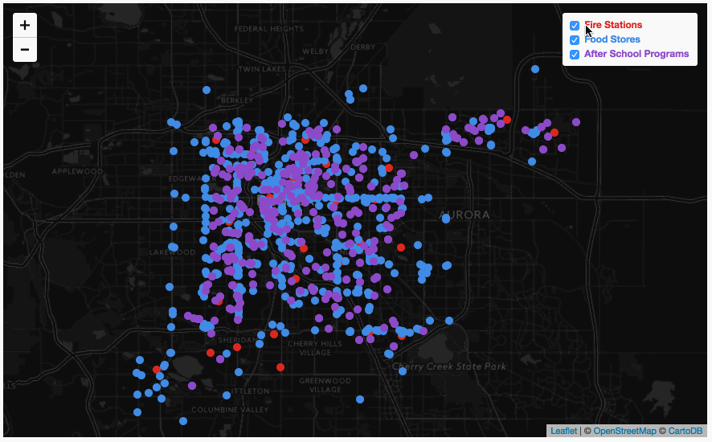

# Lab 08: Interactive web mapping with multiple layers

## Table of Contents

<!-- TOC -->

- [Lab 08: Interactive web mapping with multiple layers](#lab-08-interactive-web-mapping-with-multiple-layers)
    - [Table of Contents](#table-of-contents)
        - [Part I: Mapping Scenario: Power Plants in the United States (4pts)](#part-i-mapping-scenario-power-plants-in-the-united-states-4pts)
        - [Part II: Mapping Scenario: Amenities within distance in Denver, Colorado (6pts)](#part-ii-mapping-scenario-amenities-within-distance-in-denver-colorado-6pts)
            - [Specific map requirements](#specific-map-requirements)

<!-- /TOC -->
### Part I: Mapping Scenario: Power Plants in the United States (4pts)

We will continue working with our power plant dataset to make a polished map that provides useful interactivity for the user. Follow the lesson to build this web page and supply descriptive content to the body of the page, i.e., a proper page title, brief paragraph description of the map, etc. Commit important changes as you work and finally push it up to your remote repository when you are finished. Though not required, consider tackling the advanced section (where we apply code refactoring) and the addendum to provide summary statistics in our search radius.

 
*A solution (with extra addendum section on presenting summary stats)*

### Part II: Mapping Scenario: Amenities within distance in Denver, Colorado (6pts)

A client has recently moved to Denver, CO, and wants to buy a home within **1 km of a fire station, a food store, and an after school program**. You've been hired to make an interactive web map allowing the user to click on locations within Denver to see which of these amenities fall within the 1 km range. The map will additionally allow the user to toggle on and off the layers, as well as retrieve specific information about each amenity.

The completed map should look and behave like this:

 
*Lab 08 Solution*

Begin by opening and editing the *lab-08/index.html* file. You'll notice that a Leaflet map is drawn, centered on Denver, CO. Also, note that there are three data files within the *lab-08/data/* directory (data downloaded from the [Denver Open Data Catalog](https://www.denvergov.org/opendata/)):

* [after-school-programs.js](data/after-school-programs.js)
* [denver-fire-stations.js](data/denver-fire-stations.js)
* [denver-food-stores.js](data/denver-food-stores.js)

You should open these files and inspect their contents. Note that each contains a GeoJSON structure. Furthermore, each GeoJSON data file has been assigned to a JavaScript variable (`programs`, `stations`, and `stores`).

You should begin by loading these files into your *index.html* document. Once the data are loaded into the document, you should begin scripting your solution.

#### Specific map requirements

* Map should draw the three GeoJSON datasets as separate layers, each with their own color.
* Map should allow the user to toggle off/on each layer with a Leaflet layer control.
* Text within the layer control should double as a legend and indicate which color circles symbolize what feature.
* Circles should have a diameter of `10` pixels, no stroke, and a fill opacity level of `1`.
* When the user clicks on the map, the circles within 1 km of the clicked point should remain full opacity. All other circles will fade to a fill opacity of `0.1`.
* When the user mouses over an amenity, a tooltip will provide the following information (hint, you'll need to know the property names encoded within the GeoJSON):
    * the station number for fire stations.
    * the name of the store for food stores.
    * the name of the organization for the after school programs.
* All content generated for tooltips/popups should use template strings.
* Page should have updated title and metadata information.

Commit your work as you go and push to your repository and submit the link within Canvas by the due date.
